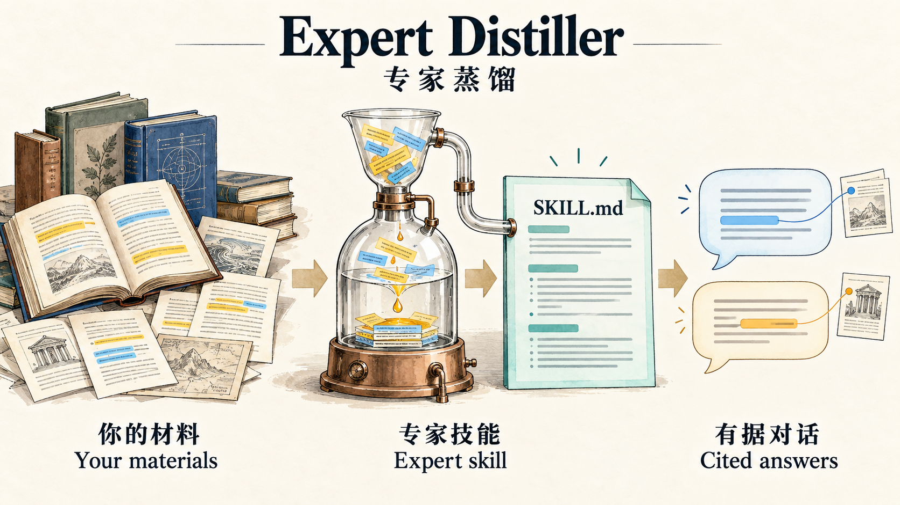
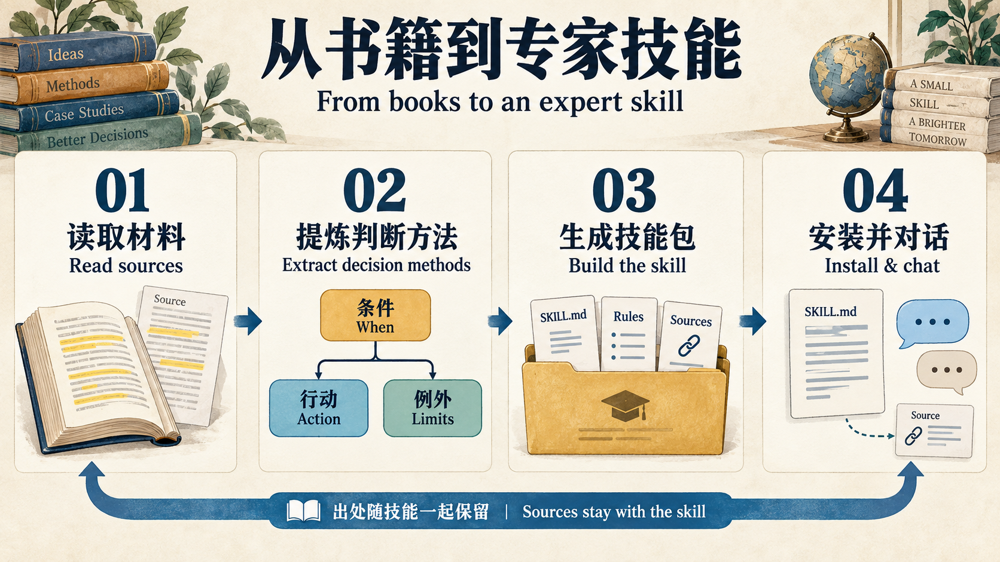
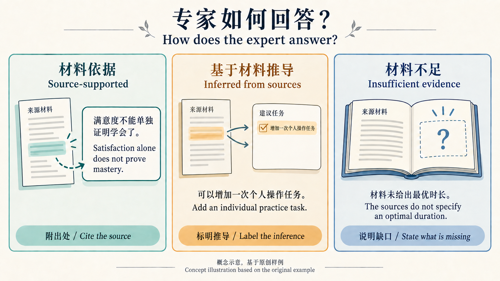

# Expert Distiller · 专家蒸馏

[简体中文](README.md) | [English](README.en.md)



**Turn the books and materials you provide into an expert skill that uses those sources to reason, explain, and discuss questions with you.**

This is a skill workflow executed by a chat model, supported by local Python tools. It does not train model weights or claim to replicate a real expert. Distillation and conversations use the model in your skill host; this project requires no separate API key. Results depend on the model, source quality, and evaluation.

## Two layers of skills



| Layer | Purpose |
|---|---|
| `expert-distiller` | Reads the materials you specify, extracts knowledge and decision methods, and generates a new expert skill |
| Generated `<domain>-expert` | Once installed, supports consultation, case analysis, and questions within the scope of those materials |

Answers distinguish **source-supported statements**, **inferences from the sources**, and **insufficient evidence**. The expert can apply source material to new questions, but must label its inferences instead of attributing them to an author. When sources disagree, it preserves their respective conditions.

## Quick start

You need Python 3.10+ and a skill host that can read local files and run scripts. TXT/Markdown tools use only the Python standard library; PDF support additionally requires `pypdf`. Convert other formats to Markdown with source locations preserved. The scripts do not access the network; how the host model handles your files depends on that service's settings.

### 1. Install the generator

```bash
git clone https://github.com/YiFengLu1999/expert-distiller.git
cd expert-distiller
python3 scripts/install.py
```

The installer copies the skill to `$CODEX_HOME/skills`, or `~/.codex/skills` if `CODEX_HOME` is unset. It refuses to overwrite an existing skill with the same name. Use `--dest /your/host/skills` to select another host's directory. Check which directory your host actually uses for skill discovery; this project has been validated with the Codex directory layout, not every client. The [official OpenAI skill documentation](https://learn.chatgpt.com/docs/build-skills) describes the SKILL.md format.

Invoke `$expert-distiller` in a new Codex conversation. If the skill list has not refreshed, open a new conversation or restart the client.

### 2. Provide materials and generate an expert

Place your materials in the local `materials/` directory, then ask Codex:

```text
Use $expert-distiller to distill these three books into research-methods-expert.
Purpose: help me formulate research questions, review arguments, and analyze cases.
Use only these materials as domain evidence. Allow inferences, but label them clearly.
Write the skill to generated/research-methods-expert.
Record what you actually read, preserve citations, validate the result,
and give me the installation command.
```

If you provide only a book title, the generator asks for the text or excerpts; it must not use model memory to pretend it has read the book. Long materials are processed in batches by chapter, with unread sections recorded. Building an index does not mean the material has been read.

### 3. Install the expert and start a conversation

```bash
python3 scripts/install.py generated/research-methods-expert
```

```text
Use $research-methods-expert to identify problems in this research proposal.
First identify the most important missing information, then give recommendations
with references to the provided materials.
```

## Try the original example



*Illustrative answer patterns based on the original example below, not an actual conversation screenshot.*

```bash
python3 scripts/install.py examples/workshop-expert
```

Then ask:

```text
Use $workshop-expert. I am teaching beginners to use a tool.
Participants report high satisfaction after the workshop.
Does that mean they have learned the skill? How should I check?
```

A source-supported answer should explain that satisfaction alone does not demonstrate skill mastery: participants need to be observed performing the task independently, without prompts. If asked for the optimal workshop duration, the expert should say the materials do not establish one. See the original [workshop-notes.md](examples/workshop-notes.md).

The bundled example materials and skill instructions are in Chinese. You can ask for answers in English; the expert should preserve the original source references. This English README does not change the language of the bundled materials.

## Tools and validation

```bash
# Build a portable evidence corpus (no semantic distillation; output must be a new file)
python3 skills/expert-distiller/scripts/corpus.py ingest materials/book.md --out generated/my-expert/references/corpus.json

# Chinese/English keyword search; scores rank matches, not evidence reliability
# Use Chinese terms here because the bundled example corpus is in Chinese
python3 skills/expert-distiller/scripts/corpus.py search examples/workshop-expert/references/corpus.json '满意度 技能'

# Check expert package structure, evidence IDs, passage hashes, and verbatim anchors
python3 skills/expert-distiller/scripts/corpus.py validate examples/workshop-expert

# Run regression tests for the local tools
python3 -m unittest discover -s tests -v
```

Optional PDF dependency: `python3 -m pip install pypdf`. Scanned documents need additional OCR; PDF reading order, formulas, and tables still require inspection. Keyword search does not provide vector-based semantic retrieval, so use synonyms and read the surrounding context. The evidence corpus is installed with the expert skill and remains usable without the original materials directory.

Structural checks do not establish semantic correctness or guarantee that a model will never hallucinate. Each expert should complete the [behavioral evaluation](skills/expert-distiller/references/evaluation.md); cases that have not actually been tested should be marked as not run. This version includes an original example and tool tests, but has not completed end-to-end behavioral evaluation on a real, full-length book.

## Relationship to Fabric

Inspired by [Daniel Miessler's Fabric](https://github.com/danielmiessler/Fabric). Its [extract_book_ideas](https://github.com/danielmiessler/Fabric/blob/main/data/patterns/extract_book_ideas/system.md) pattern extracts ideas from books; the version reviewed includes instructions to retrieve book content from model memory. For workflows that require using only the materials actually provided, this project adds source verification, decision rules, reading coverage, and installable expert packages. This comparison concerns that particular pattern, not the complete capabilities of Fabric. This project was written independently and does not copy Fabric's prompts.

## Files and privacy

- `skills/expert-distiller/`: the complete generator, installable on its own.
- `examples/`: original short source material and an installable example expert.
- `scripts/install.py`: installs by copying local files; does not overwrite existing installations.
- `tests/`: tests for material processing, broken citations, and installation behavior.
- `materials/` and `generated/` are ignored by Git by default. They may contain full texts and private materials. Review staged files before publishing; `.gitignore` is not access control.

The project code, skill instructions, and original examples are licensed under MIT. This does not change the rights associated with user-provided books or other third-party materials.

The illustrations use bilingual labels. See [visual asset notes](docs/visual-assets.md) for the generation method and full prompts.
